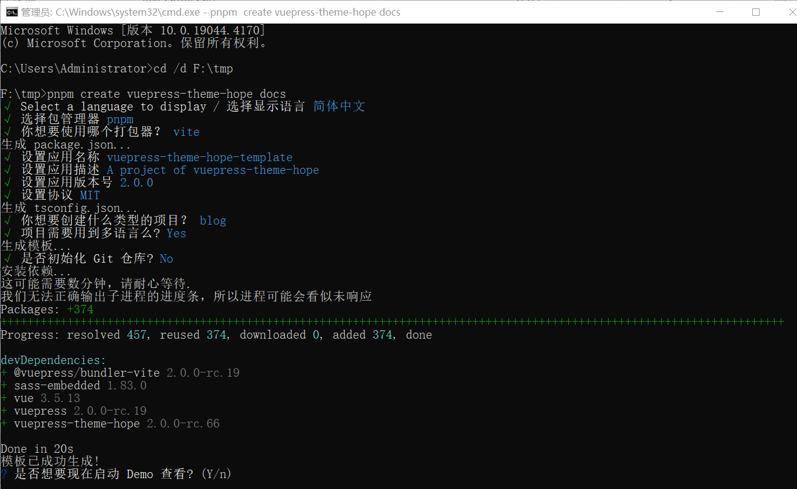

```component VPBanner
title: 温馨提示
content: 本文默认您熟悉基本的命令行操作和环境变量配置。若您是初学者，建议先了解如 <i>Chocolatey</i> 等包管理工具。
background: var(--bg-10)
color: var(--banner-text)
logo: logo.svg
actions:
  - text: 了解 Chocolatey
    link: /toolkit/software/chocolatey.md
```

## 一、准备工作

### 1. 阅读官方文档
在开始之前，强烈建议您仔细阅读 [VuePress 官方文档](https://vuejs.press/zh/)，特别是“快速上手”部分，以了解其核心概念。

### 2. 选择主题
VuePress 拥有丰富的主题生态。本教程将以功能强大且广受欢迎的 [VuePress Theme Hope](https://theme-hope.vuejs.press/zh/) 为例。

## 二、安装与初始化

### 1. 创建项目
Theme Hope 提供了便捷的脚手架工具，可以快速创建一个预配置好的项目模板。

- **操作指南**：请参考官方的[创建项目](https://theme-hope.vuejs.press/zh/get-started/create.html)文档，通过命令行交互式地完成项目创建。



### 2. 项目常用命令
进入项目目录后，您可以使用以下命令来管理您的博客：

::: tabs#shell
@tab pnpm
```bash
# 启动开发服务器，实时预览
pnpm docs:dev
# 构建项目，生成静态文件用于部署
pnpm docs:build
# 清除缓存并启动开发服务器
pnpm docs:clean-dev
```
@tab yarn
```bash
yarn docs:dev
yarn docs:build
yarn docs:clean-dev
```
@tab npm
```bash
npm run docs:dev
npm run docs:build
npm run docs:clean-dev
```
:::

### 3. 升级版本
为了保持主题和 VuePress 的功能最新，可以定期使用官方提供的更新工具：

```bash
# 使用 pnpm
pnpm dlx vp-update
```

## 三、核心配置

### 1. 站点配置 (`config.ts`)
此文件位于 `.vuepress/` 目录下，用于配置 VuePress 站点的基本信息，如语言、标题、描述等。这些配置是全局性的，与主题无关。

- **参考**：[VuePress 配置参考](https://vuejs.press/zh/reference/config.html)

### 2. 主题配置 (`theme.ts`)
此文件同样位于 `.vuepress/` 目录下，专门用于配置 Theme Hope 的各项功能，如导航栏、侧边栏、博客功能、插件等。

- **参考**：[Theme Hope 主题配置](https://theme-hope.vuejs.press/zh/config/)
- **示例**：[Theme Hope 文档的配置文件](https://github.com/vuepress-theme-hope/vuepress-theme-hope/blob/main/docs/theme/src/.vuepress/config.ts)

### 3. 博客首页配置
编辑项目根目录下的 `README.md`（或指定语言目录下的，如 `zh/README.md`），设置 `home: true` 并配置 `hero`、`features` 等字段，来打造个性化的博客首页。

- **参考**：[Theme Hope 博客首页指南](https://theme-hope.vuejs.press/zh/guide/blog/home.html)

### 4. 导航栏与侧边栏
- **导航栏 (`navbar.ts`)**: 在 `.vuepress/navbar/` 目录下配置顶部导航链接。
- **侧边栏 (`sidebar.ts`)**: 在 `.vuepress/sidebar/` 目录下配置文档页面的侧边栏。Theme Hope 支持根据文件结构自动生成侧边栏，也支持手动配置。

## 四、功能与内容

### 1. 评论功能
Theme Hope 内置了多种评论插件，如 Giscus。您只需在主题配置中启用并提供必要的参数即可。

- **参考**：[启用 Giscus 评论](https://theme-hope.vuejs.press/zh/guide/feature/comment.html#giscus)

### 2. Markdown 增强
主题提供了丰富的 Markdown 语法增强，例如提示容器、选项卡、代码块分组等，使内容展示更具表现力。

- **参考**：[Theme Hope Markdown 指南](https://theme-hope.vuejs.press/zh/guide/markdown/)

## 五、搜索

::: info

- **参考**：[搜索](https://theme-hope.vuejs.press/zh/guide/feature/search.html)`#使用 @vuepress/plugin-docsearch`

- 关于搜索插件的可用选项，详见 [插件文档](https://ecosystem.vuejs.press/zh/plugins/search/slimsearch.html)。

:::

::: warning

1. 进入 [DocSearch](https://docsearch.algolia.com/apply/) 后，根据提示操作默认配置即可！**出错可尝试重试**！

2. 申请时填写的爬虫名称就是后面配置中需要的 `indexName`。

3. 安装 `@vuepress/plugin-docsearch` 后要运行命令 `pnpm install` ，防止部署出错！

4. `plugins.docsearch` 配置

   ```ts
   import { hopeTheme } from "vuepress-theme-hope";

   export default hopeTheme({
     plugins: {
       docsearch: {
        // appId, apiKey 和 indexName 是必填的
        appId: "YOUR_APP_ID",
        apiKey: "YOUR_API_KEY",
        indexName: "YOUR_INDEX_NAME",
       },
     },
   });
   ```
:::


## 六、部署

### 1. 推送到 GitHub
将您的本地项目初始化为 Git 仓库，并将其推送到一个新的 GitHub 仓库中。

```sh
git init
git add .
git commit -m "Initial commit"
git branch -M main
git remote add origin https://github.com/your-username/your-repo.git
git push -u origin main
```

### 2. 使用 Netlify/Vercel/Cloudflare Pages 部署
将您的 GitHub 仓库关联到任一静态托管平台，并进行如下配置：

- **构建命令**: `pnpm docs:build` (或使用 `yarn`/`npm`)
- **发布目录**: `src/.vuepress/dist`

平台会自动在您每次推送到 `main` 分支时重新构建和部署您的博客。

- **参考**：[Theme Hope 部署指南](https://theme-hope.vuejs.press/zh/get-started/deploy.html)


