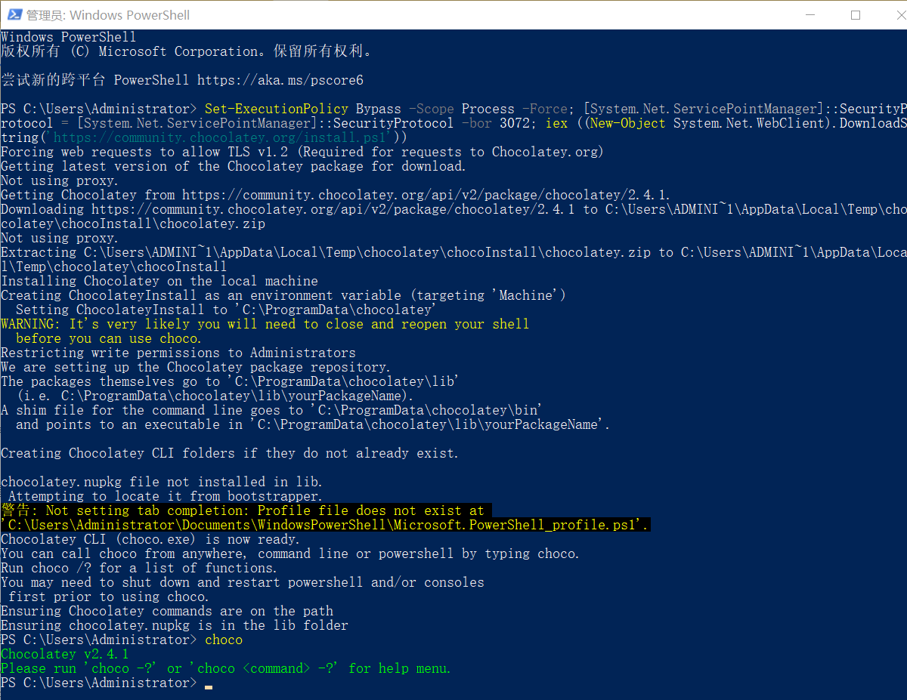

## 痛点：传统的 Windows 软件安装

在 Windows 上安装软件，尤其是开发者工具，通常意味着：
1.  **手动下载**：打开浏览器，搜索官网，找到并下载安装包。
2.  **图形化安装**：双击 `.exe` 或 `.msi`，不断点击“下一步”。
3.  **手动配置环境变量**：打开高级系统设置，找到 `Path` 变量，小心翼翼地添加新的路径。

这个过程繁琐、耗时且容易出错。而 **Chocolatey** 正是解决这一痛点的利器。

## Chocolatey 是什么？

**Chocolatey** 是一个为 Windows 设计的命令行包管理器，类似于 Linux 上的 `apt` 或 `yum`。它允许您使用简单的命令来查找、安装、升级和卸载软件，并能自动处理路径和依赖关系，极大地提升了效率。

- **官方网站**: [https://chocolatey.org/](https://chocolatey.org/)
- **官方软件仓库**: [https://community.chocolatey.org/packages](https://community.chocolatey.org/packages)

## 安装 Chocolatey

根据官方文档，您可以通过 CMD 或 PowerShell 进行安装。

::: important
请务必以 **管理员身份** 运行您的终端。
:::

### 方式一：使用命令提示符 (CMD)
```powershell
@"%SystemRoot%\System32\WindowsPowerShell\v1.0\powershell.exe" -NoProfile -InputFormat None -ExecutionPolicy Bypass -Command "[System.Net.ServicePointManager]::SecurityProtocol = 3072; iex ((New-Object System.Net.WebClient).DownloadString('https://community.chocolatey.org/install.ps1'))" && SET "PATH=%PATH%;%ALLUSERSPROFILE%\chocolatey\bin"
```

### 方式二：使用 Windows PowerShell
```powershell
Set-ExecutionPolicy Bypass -Scope Process -Force; [System.Net.ServicePointManager]::SecurityProtocol = [System.Net.ServicePointManager]::SecurityProtocol -bor 3072; iex ((New-Object System.Net.WebClient).DownloadString('https://community.chocolatey.org/install.ps1'))
```

### 验证安装
安装完成后，重新打开一个管理员终端，输入以下命令：
```sh
choco
```
如果看到版本号等信息输出，即表示安装成功。



## 核心命令与示例

掌握以下几个核心命令，您就能应对绝大部分软件管理需求。

| 命令 | 作用 | 示例 |
| :--- | :--- | :--- |
| `choco search <关键词>` | 搜索可用的软件包 | `choco search git` |
| `choco info <包名>` | 查看软件包的详细信息 | `choco info vscode` |
| `choco install <包名>` | 安装指定的软件包 | `choco install nodejs-lts` |
| `choco upgrade <包名>` | 升级指定的软件包 | `choco upgrade 7zip` |
| `choco uninstall <包名>` | 卸载指定的软件包 | `choco uninstall googlechrome` |
| `choco list -l` | 列出所有本地已安装的包 | `choco list -l` |

**示例：安装 Node.js (LTS) 和 Git**

只需在终端中执行以下两条命令，即可完成安装并自动配置好环境变量：
```sh
# 安装 Node.js 长期支持版
choco install nodejs-lts -y

# 安装 Git
choco install git -y
```
其中 `-y` 参数表示自动确认所有提示，实现无人值守安装。
```