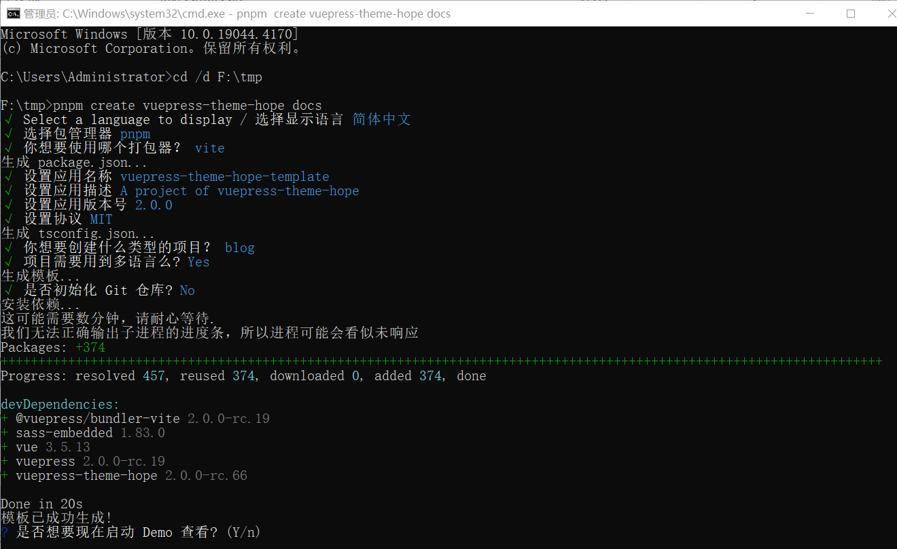

```component VPBanner
title: 温馨提示
content: 本文默认你是配置环境变量的熟手，如果你没有相关的经验，请从<i>Chocolatey</i>开始。
background: var(--bg-10)
color: var(--banner-text)
logo: logo.svg
actions:
  - text: Chocolatey
    link: ../software/chocolatey.md
```

## 准备工作

### VuePress 文档

认真阅读 VuePress 官方文档，建议从**快速上手**开始。

::: info 

- [VuePress 官方文档](https://vuejs.press/zh/)

:::


### VuePress 主题

在 VuePress 官网上选择一个你喜欢的主题。

::: info 

- [VuePress 官网主题](https://marketplace.vuejs.press/zh/themes/)

:::

## 安装

### 创建项目

下面以使用主题 [Theme Hope](https://theme-hope.vuejs.press/zh/) 搭建博客为例。

- [快速上手→创建项目](https://theme-hope.vuejs.press/zh/get-started/create.html)，完整过程如下图所示：




### 项目命令

运行路径：`F:\tmp\docs`。

#### 常用命令

::: tabs#shell

@tab pnpm

- `pnpm docs:dev` 启动开发服务器
- `pnpm docs:build` 构建项目并输出
- `pnpm docs:clean-dev` 清除缓存并启动开发服务器

@tab yarn

- `yarn docs:dev` 启动开发服务器
- `yarn docs:build` 构建项目并输出
- `yarn docs:clean-dev` 清除缓存并启动开发服务器

@tab npm

- `npm run docs:dev` 启动开发服务器
- `npm run docs:build` 构建项目并输出
- `npm run docs:clean-dev` 清除缓存并启动开发服务器

:::


#### 升级版本

要升级主题和 VuePress 版本，请执行以下命令:

::: tabs#shell

@tab pnpm
```bash
pnpm dlx vp-update
```

@tab yarn
```bash
yarn dlx vp-update
```

@tab npm
```bash
npx vp-update
```

:::


::: tip 在 Windows 上打开终端

请使用文件管理器打开对应文件夹，然后在上方的地址栏中输入 `cmd` 并按下回车。

:::

## 配置

### 项目内容

- 在 VuePress 项目生成页面。

::: info
- [快速上手→项目内容](https://theme-hope.vuejs.press/zh/get-started/content.html)
:::

### 配置项目

按配置作用域，可以将其分为两种：站点配置和主题配置。


#### 站点配置

- 站点配置中的配置项被 VuePress 直接读取，和主题无关且在所有主题均可生效，是必要的。

- 示例路径：`F:\tmp\docs\src\.vuepress\config.ts` 。

- 其中的 `lang`，`title` 和 `description` 属性，按规则修改。

::: info

你可以前往[VuePress2 → 参考 → 配置](https://vuejs.press/zh/reference/config.html)查看所有 VuePress 配置。

:::

#### 主题配置

- 主题配置是你传递给 hopeTheme 函数的对象，它将由 Theme Hope 处理。

- 示例路径：`F:\tmp\docs\src\.vuepress\theme.ts` 。

::: info

- 你可以前往[配置 → 主题配置](https://theme-hope.vuejs.press/zh/config/) 中找到全部的主题配置，按规则修改。

- 你还可以查看[“Theme Hope文档”主题配置](https://github.com/vuepress-theme-hope/vuepress-theme-hope/blob/main/docs/theme/src/.vuepress/config.ts)作为修改配置的参考。

:::

### 博客首页

- `博客类型主页`示例路径：`F:\tmp\docs\src\zh\README.md`。

- 删掉`footer: 自定义你的页脚文字`后面的全部内容。
  
- `footer: 自定义你的页脚文字`可以改成
  
```txt
footer: '主题使用 <a href="https://theme-hope.vuejs.press/zh/" target="_blank">VuePress Theme Hope</a>'
```

::: info

[指南→博客首页](https://theme-hope.vuejs.press/zh/guide/blog/home.html) ，建议顺便把博客目录的内容认真读完。

:::

### 导航栏

- 它们都是可配置的，你也可以完全自定义导航栏布局。

- 示例路径：`F:\tmp\docs\src\.vuepress\navbar\zh.ts`

::: info

- [指南→导航栏](https://theme-hope.vuejs.press/zh/guide/layout/navbar.html) 
- ["Theme Hope文档"导航栏配置](https://github.com/vuepress-theme-hope/vuepress-theme-hope/blob/main/docs/theme/src/.vuepress/navbar/zh.ts)
- ["Mister-Hope"导航栏配置](https://github.com/Mister-Hope/Mister-Hope.github.io/blob/main/src/.vuepress/navbar.ts)
:::

### 侧边栏

- 侧边栏包含相关的文档列表，文档标题以及博客模式下的博主信息。

- 主题允许你通过文件结构和文档标题自动生成侧边栏，也可以手动配置。

- 示例路径：`F:\tmp\docs\src\.vuepress\sidebar\zh.ts`

::: info
- [指南→侧边栏](https://theme-hope.vuejs.press/zh/guide/layout/sidebar.html) 
- ["Theme Hope文档"侧边栏配置](https://github.com/vuepress-theme-hope/vuepress-theme-hope/blob/main/docs/theme/src/.vuepress/sidebar/zh.ts)
- ["Mister-Hope"侧边栏配置](https://github.com/Mister-Hope/Mister-Hope.github.io/blob/main/src/.vuepress/sidebar)
:::

### 项目结构

- VuePress 项目结构

::: info
- [快速上手→项目结构](https://theme-hope.vuejs.press/zh/get-started/structure.html)
:::

### 评论

Giscus 是一个基于 GitHub Discussion 的评论系统，启用简便。

::: info
[指南→评论#Giscus](https://theme-hope.vuejs.press/zh/guide/feature/comment.html#giscus)

:::

## 界面

指南→界面→[图标支持](https://theme-hope.vuejs.press/zh/guide/interface/icon.html)`#浏览图标列表`，Fontawesome: https://fontawesome.com/search?o=r&m=free

## Markdown

指南→Markdown→样式化→[提示容器](https://theme-hope.vuejs.press/zh/guide/markdown/stylize/hint.html)`#演示`。

指南→Markdown→样式化→[上下角标](https://theme-hope.vuejs.press/zh/guide/markdown/stylize/sup-sub.html)`#语法`。

指南→Markdown→语法→[数学公式](https://theme-hope.vuejs.press/zh/guide/markdown/grammar/math.html)`#支持列表→Katex`。

指南→Markdown→语法→[选项卡](https://theme-hope.vuejs.press/zh/guide/markdown/content/tabs.html)`#案例`。

指南→Markdown→代码→[代码块分组](https://theme-hope.vuejs.press/zh/guide/markdown/code/code-tabs.html)`#演示`。

## 推送到 GitHub

打开 [GitHub](https://github.com/) 新建一个存储库，在 `F:\tmp\docs` 目录中输入`cmd`按回车，依次输入下面的代码并按回车。

```sh
git init
git add .
git commit -m "first commit"
git branch -M main
git remote add origin https://github.com/user/repo.git
git push -u origin main
```

::: warning

请按需配置！

1. 设置 Git 全局用户信息

```sh
git config --global user.email "you@example.com"
git config --global user.name "Your Name"
```

2. 使用 Token 认证

`Browser/Device` → `Sign in with your browser` → 输入`Username`(GitHub 用户名)和`Password`(生成的 Token)

:::

## 部署项目

部署 VuePress 项目。

::: info
- [快速上手→部署项目](https://theme-hope.vuejs.press/zh/get-started/deploy.html)
:::
